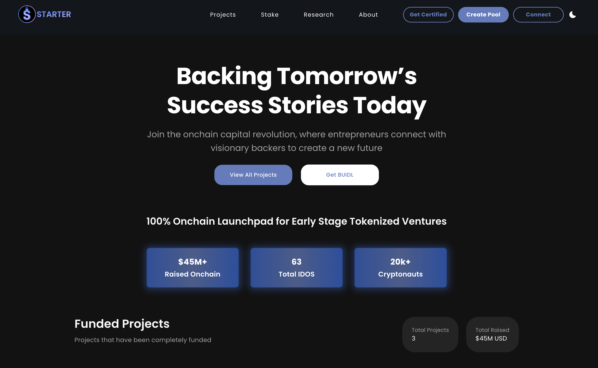

# 👋 Welcome

<figure><figcaption></figcaption></figure>


**Fun Fact:** Starter.xyz is developed by [Starter Labs](https://starterlabs.xyz), a leading blockchain R\&D company based in the USA. We operate the only [physical coworking space and IRL incubator](https://atlantachain.io) for blockchain companies in the fintech payments capital of the world. An international company, Starter International, uses the Starter.xyz product to facilitate onchain capital formation for projects. We helped builders launch 60+ IDOs and raise $45M+ on Polygon, Ethereum, Fantom, Avalanche and Binance Smart Chain during the last market cycle.


## The Early Stage Problem

Early stage project launches eventually take the form of Initial Decentralized Offerings, or IDOs, and comes with a myriad of unnecessary risks for both developers and investors alike. With new tokens popping up constantly, it can be nearly impossible for investors to sort out the gems from the scams and for legitimate developers to stand out from the pack. Developers looking to launch a new project face the daunting tasks of constructing a fair presale offering, attracting investors that will support their vision, and then providing liquidity for their token. Investors acting alone must sort through a crowded landscape of projects and create their own metrics for evaluating presales.

## BUIDLing a Solution

In the spirit of decentralization, Starter provides an ecosystem that empowers the community of BUIDL token holders to ensure the fair launch of new projects for developers and investors. Through a simple on-chain application, developers may submit their IDOs to the Starter community for them to review the project and terms of the presale.The BUIDL token rewards holders who stake their tokens on the platform by allowing them to vote on which projects are launched on the platform and participate in the approved presale projects, placing the power in the hands of investors.

## A Certified Start

As a highly experienced team of founders, Starter operates the Certified BUIDLer program, which sees the team handpick the most promising projects from across the Base ecosystem and offer them as exclusive IDOs. Unlike the self-submitted IDOs which the community are empowered to vote on, Certified BUIDLer IDOs undergo heavy vetting of their project, strategy, and full KYC, to ensure only the best and most trustworthy projects are presented to the Starter community. We believe this combination of self service and team vetted project offering will result in amazing early stage opportunities for the Base ecosystem.

Founders who have successfully completed the [Immutable Founders IRL incubator](https://atlantachain.io/incubator) operated by Starter Labs automatically qualify for funding in Starter International's Certified BUIDLer program.

<figure><figcaption></figcaption></figure>

## Quick links


[projects-and-voting.md](overview/projects-and-voting.md)



[tiers-and-staking.md](overview/tiers-and-staking.md)



[staking-rewards.md](overview/staking-rewards.md)



[stake-drop.md](overview/stake-drop.md)



[listing-projects.md](overview/listing-projects.md)



[tokenomics.md](overview/tokenomics.md)



[roadmap.md](overview/roadmap.md)



[lockonbase.md](overview/lockonbase.md)



[about-the-team.md](overview/about-the-team.md)


