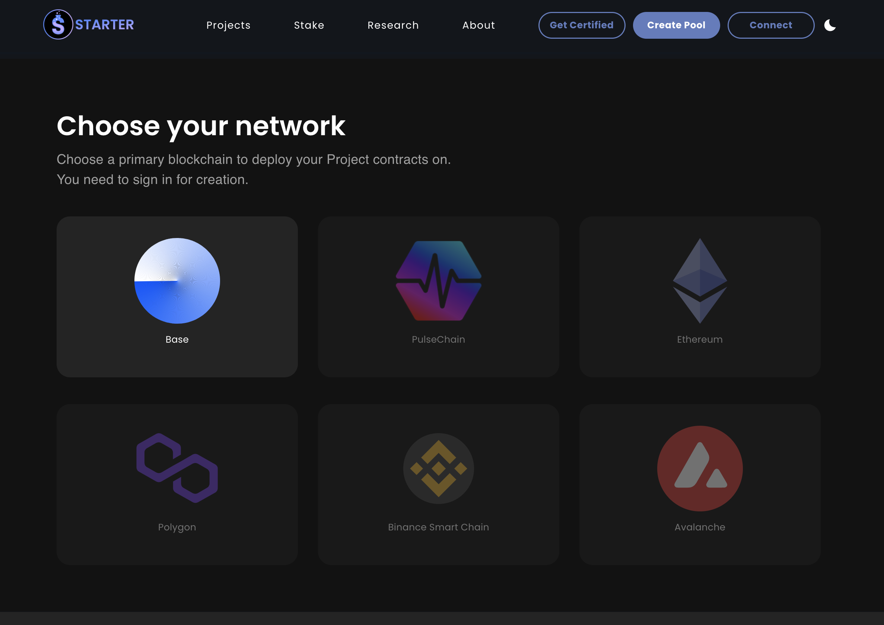
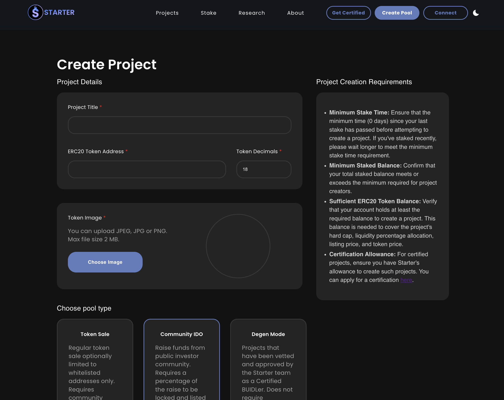
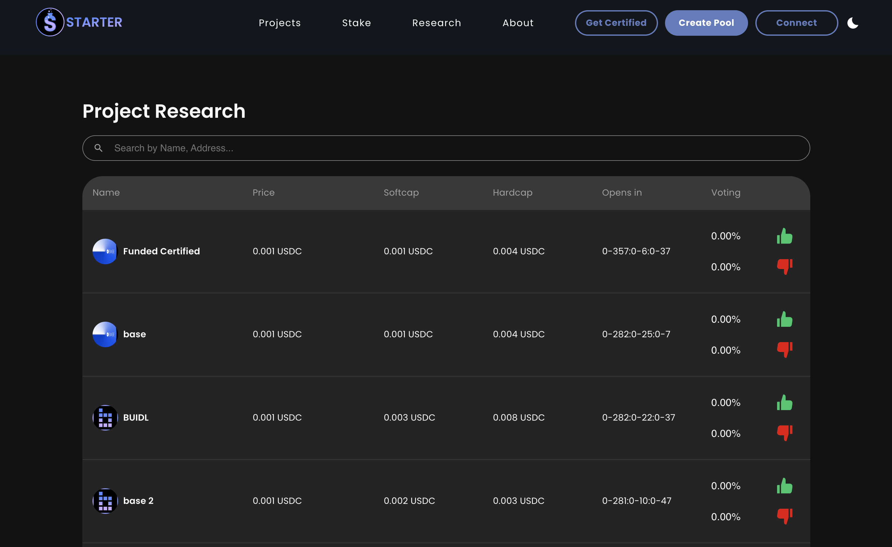
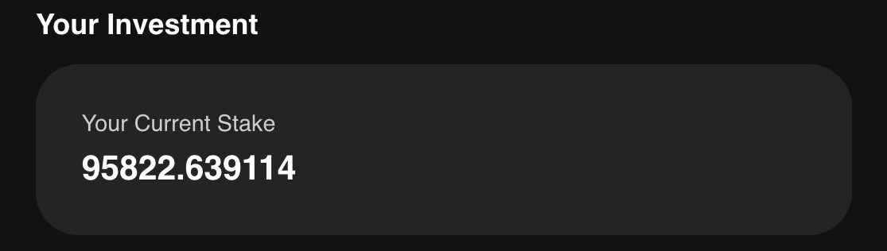

# 📔 Listing Projects

<figure><figcaption></figcaption></figure>

## Apply for a Certified BUIDLer Listing

Certified BUIDLer IDOs are not required to go through the voting process and can only be created by our team. If you would like to apply for a Certified BUIDLer IDO with Starter, you can apply here: [**Certified BUIDLer Application**](https://tinyurl.com/BaseCertifiedBUIDLer)

Or...

## Create your IDO pool using the self-service method

Launching an IDO on Starter is a fairly straight-forward process:

To skip straight to the onchain form, visit the website and connect your wallet, then use  in the top right of your browser [or ](https://starter.xyz/#/apply)otherwise, refer to the below prior to completing the application to understand the listing process and requirements **before** applying.

* **You need to have a minimum of Gold Tier in order to create an onchain listing** (_see the_ [_**Stake page**_](../product-guides/how-to-stake-tokens-and-secure-your-tier.md) _for more information_)
* Upon application submission, your presale smart contract is generated according to the terms outlined in the form fields.
* **Community members who stake at least 5000 BUIDL on the platform have the opportunity to perform due diligence on your project and vote "Yes" or "No" on your listing. (Unless you are a Certified BUIDLer or Degen listing in which case voting wont be required)**
* Votes are weighted by the amount of BUIDL tokens each voter has staked.
* **The voting formula for whether your presale will proceed is as follows:**
  * "Yes" votes minus "No" votes must be greater than 20,000,000 (10% of the max supply)

**\*Before applying, we highly recommend you read our Top Tips on Creating a Successful IDO here:** [https://starterxyz.medium.com/how-to-create-a-successful-ido-with-starter-c17901f95796](https://starterxyz.medium.com/how-to-create-a-successful-ido-with-starter-c17901f95796)

<figure><figcaption></figcaption></figure>

When going to apply, you'll need all the following information ready to hand:


_Tokenomics & Token Sale Plan (Basic Project Info)_

* &#x20;**Pool Type**                                                                                                                                        \
  _- **Token Sale** - Use this option to hold a seed or private sale, optionally limited to whitelisted addresses only. Requires community voting to get funded and investors must be staking in one of our_ [_Staking Tiers_](tiers-and-staking.md)_._ \
  _- **Public IDO** - Select this option to raise funds and use a percentage of the raise to eventually list on a DEX. Requires community voting to get funded and investors must be staking in one of our_ [_Staking Tiers_](tiers-and-staking.md)_._ \
  _- **Degen** - This method allows anyone to create a project listing without staking BUIDL or community voting. It will be flagged as a degen listing to inform other users._
* _**Certified BUIDLer**_ - _This option eliminates the need for community voting. Select this if you have been approved by the Starter team as a Certified BUIDLer. Note: only pre-approved dev wallets given the Certified stamp can choose this option._&#x20;
* **ERC20 Token Address**                                                                                                      \
  _- The ERC20 Token Address of your project's smart contract._  &#x20;
  * _e.g. "0xac74f925B25928a95A0159067B64B6C4e33C41fa"_
* **Token Decimals**                                                                                                                                \
  \- _The limit of the number of decimals for your token quantities._
* **Funding Token**                                                                                                                                           \
  _- The token you would like to receive for funding (e.g. ETH, USDC)_   &#x20;
* **Token Price**                                                                                                                                           \
  _- The price of your token per unit in ETH_               &#x20;
  * _e.g. "0.0058 ETH per BUIDL"_
* **Soft Cap (ETH)**                                                                                                           \
  _- The minimum amount of ETH required from a pool to be launched on Starter._
  * _e.g. "100 ETH"_
* **HardCap (ETH)**                                                                                                                                 _- The total amount of ETH that can be pooled before launch._
  * _e.g. "750 ETH"_
* **Min and Max ETH Per Wallet                                                                                                                             **_**-** The min/max amount of ETH that each investor may contribute to your presale. This option is only present for Token Sale pools, as IDOs allocations are determined by our tiers and guaranteed allocation model._
  * _e.g. "0.10 ETH"_
* **Allocation Factor**\
  **-** _This is the formula that works out how much of your token investors will be able to buy during IDO, based on how much BUIDL they have staked._&#x20;
  * The formula is as follows:\
    _Your BUIDL_ \* _Alloc Factor\* 2 /_ 55000 (e.g. For someone who has 50000 BUIDL staked: 50000 \* 2 ETH \* 2/55000 = 3.63 (So the max amount of your token they could buy (in ETH) would be 3.63 ETH.
* **Sale Start Time**                                                                                                                                  \
  _- The date and time your presale will begin accepting investor funds.  **Time Zone = UTC.**_
  * _e.g. "March 09, 2024 10:00 AM"_
* **Sale End Time**                                                                                                                                   \
  _- The date and time your presale will stop accepting investor funds.  **Time Zone = UTC.**_
  * _e.g. "March 09, 2024 14:00 PM"_
* **Head Start for GA (in seconds)**                                                                                                                                             - _The time in seconds that you want to give to the guaranteed allocation round to buy first. We suggest a minimum of 2 minutes (120 seconds) but most usually go with 10 minutes (600 seconds)._
* **Unsold Tokens Address**                                                                                                                      \
  \- _The address where any unsold tokens will be sent when the presale is completed._
  * _e.g. "https://basescan.com/address/0xac74f925B25928a95A0159067B64B6C4e33C41fa"_
* **Release Per Cycle (%) -** _the percentage of tokens that will be claimable by investors every cycle. For example, entering 10 will only release 10% of tokens every Release Cycle (below)...entering 50 will release 50% of tokens every cycle, and so on_
* **Release Cycle (In Seconds) -** _the period of time in seconds that tokens can be claimed. For example, if tokens can be claimed Daily enter 86400; if can be claimed Monthly enter 2592000; etc_
* **Release at TGE (%):** The percentage of your tokens to be unlocked at TGE.
* **Vesting Cliff (Days):** The number of days post TGE tokens must remain locked before claiming can begin.
* **Category -** _select the closest category your project falls under for reporting purposes._
* **Sale Type -** _choose the type of sale being created. **Seed** represents the first and earliest round of funds being raised; **Private** represents a follow-up round of funding for private investors; **Strategic** represents unique rounds, such as KOL or partnership allocations; **Public** represents a public sale, such as a sale for an IDO._



_DEX Listing Plan_

* **DEX Listing Price**                                                                                                            \
  \- _The listing price of your token in ETH when it is available to trade on a DEX._
  * _e.g. "0.0068 ETH per BUIDL"_
* **DEX Liquidity Pool (LP) Allocation Percent**                                                                                        - _The percentage of the raised funds that will be used for the LP on a DEX._
  * _e.g. "40%"_
* **DEX Listing Time**                                                                                                             \
  \- _The date and time when your LP on the DEX will be available for trading._
  * _e.g. "March 09, 2024 14:30PM"_
* **DEX Liquidity Pool (LP) lock duration days**                                                                                       _- The number of days that your liquidity will be locked in the LP on the DEX._
  * _e.g. "275 days"_



_Project Info & Current Web Presence_

* **Pool Title**                                                                                                                                 - _The title of your project._
  * _e.g. "BUIDL Public Presale"_
* **Description**                                                                                                                                         \
  _- Description of your project / mission statement._
* **Project Logo (Please use -** [**TinyURL**](https://tinyurl.com/app) **to reduce path length)**                                                                                                                      _- Upload the image of your project's logo._
* **Main Image and Supporting Images** \
  **-** _You may add a main image and 5 additional images to spice up your listing._
* **Telegram (**_**Optional**_**)**                                                                                                                            _- Telegram group chat link._
  * _e.g. "https://t.me/starterlabshq"_
* **GitHub**                                                                                                                                                     \
  \- _Your project's GitHub URL_
  * _e.g. "https://github.com/barchef"_
* **Twitter (**_**Optional**_**)**                                                                                                                                  _- Twitter link._
  * _e.g. "https://twitter.com/starterlabshq"_
* **Website (**_**Optional**_**)**                                                                                                                           _- Website link._
* **Know Your Customer (KYC) URL (**_**Optional**_**)**                                                                                     - _Link to KYC Documents_&#x20;
* **Whitepaper URL (**_**Optional**_**)**                                                                                                        _- Link to your project's whitepaper._
*   **Audit URL (**_**Optional**_**)**                                                                                                         \
    _- Link to your project's audit report(s)._

    _**Verified**_: check this box if the audit passed and all issues were resolved, if any.



_Whitelisting_

* This is the list of ERC20 wallet addresses that will have access to your presale.  If you choose to upload a whitelist, only the addresses on the whitelist will be eligible to participate in your presale.
* Ignore this section if you do not wish to use a whitelist.
* Create your entries in a file by input only one address per line. Upload the file as a .CSV
  * _e.g._\
    _0xF977814e90dA44bFA03b6295A0616a897441aceC_\
    _0xF68a4b64162906efF0fF6aE34E2bB1Cd42FEf62d_\
    _0xBE0eB53F46cd790Cd13851d5EFf43D12404d33E8_



* If you're completing the [**Certified BUIDLer Application**](https://tinyurl.com/BaseCertifiedBUIDLer) you will be required to upload a 'Presentation Deck' for your project during the application, as well as some other details such as info on any previous raises, etc.


## Voting Process (Detailed)

As soon as you have listed a project, your listing will be live in the voting area. It will then remain open until the time the IDO is about to start. Each holder only needs 10000 minimum BUIDL to vote.&#x20;

<figure><figcaption></figcaption></figure>

For a project to list, it needs to have **20,000,000 net YES votes** during the voting phase (NET = Yes - No votes) where 1 Staked BUIDL = 1 vote, so if someone with 50000 BUIDL voted YES they would increase the number of the YES votes by 50000. Conversely, this same function works against the project when it is voted NO by the staker. **Only the STAKED amount of BUIDL by the investor will be reflected in the voting (So any BUIDL in a wallet will not count towards the vote).**

<figure><figcaption></figcaption></figure>

If the time for the IDO to launch comes and the pool does not have enough votes then it will cancel and you'll be refunded the tokens that you deposited when creating the pool.


All good to go? Then visit the website [starter.xyz](https://starter.xyz) and create your pool now!                                                                                                                              &#x20;

&#x20;If you're a well-established project, we'd recommend taking the time to fill in our [**Certified BUIDLer Application**](https://tinyurl.com/BaseCertifiedBUIDLer) instead.

