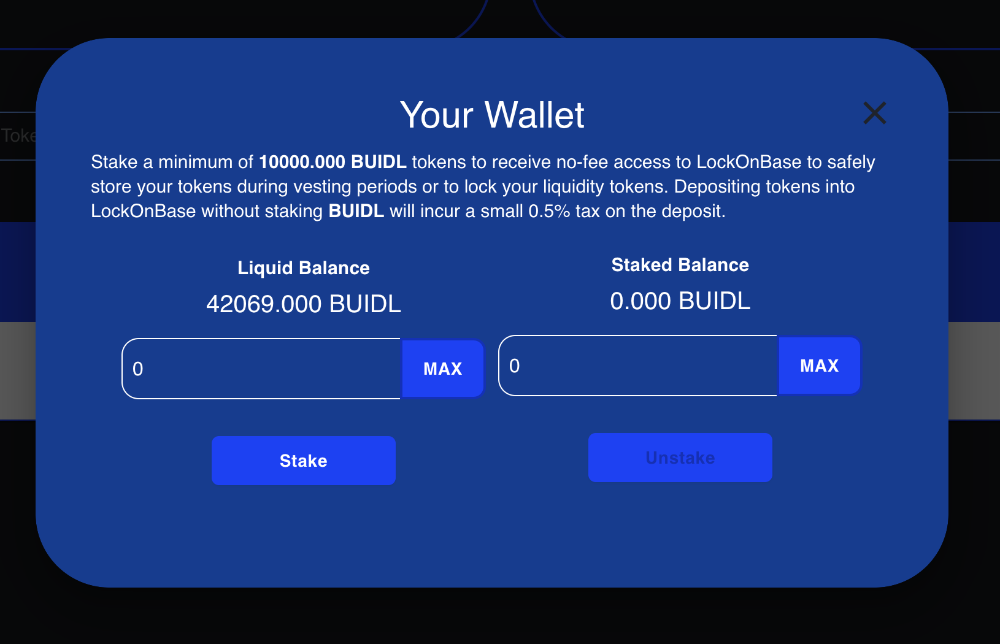

# 🔐 LockOnBase

LockOnBase is the user-friendly token vesting and liquidity locker created and used by Starter. It can be used by any project to protect their project's liquidity or to vest tokens over a period of time.&#x20;

<figure><figcaption></figcaption></figure>

The key features of LockOnBase include:


• Lock any ERC20 token away for any period of time

• Support for Fee on Transfer tokens

• Useful for locking liquidity for new, unproven projects

• Proven and audited codebase, previously used to store over $40M in TVL on BSC

• Very small 0.5% locker deposit fee to use the service

• Stake BUIDL tokens to use LockOnBase 100% free of charge


<figure><figcaption></figcaption></figure>

By default, LockOnBase charges a small 0.5% tax on all deposits in its locker. To avoid paying the locker deposit fee, you can stake a minimum of 10000 BUIDL tokens in the system.

<figure><figcaption>
Self explanatory LockOnBase staking dialog
</figcaption></figure>

Locking a token is extremely easy. Simply click New Lock on the navigation bar to bring up the New Lock window below.

<figure><figcaption>
Creating a new lock
</figcaption></figure>


_**Token Address**_ - paste the token contract address of the token you would like to lock. This can be any valid ERC20 token address. If the token is valid, LockOnBase will show a preview of the token's name, symbol, and your balance below the Token Address field.

_**Lock Amount**_ - enter the amount of tokens you would like to lock. Or click the Max button to lock all the tokens in the currently connected wallet.

_**Unlock Date**_ - enter the number of days you would like to lock this token. For example, enter 30 to lock the token for 1 month; 90 to lock for 3 months or 365 to lock for an entire year.

Once you're done, click the **Lock** button to initiate the transfer into the locker.&#x20;



If this is your first time interacting with LockOnBase for this particular token, you will be prompted to approve the transaction amount first and then prompted again to complete the actual lock. That's it!

