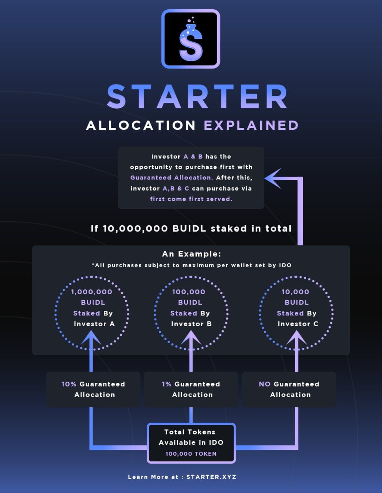

# 💡 Projects & Voting


**You're Early!** Early stage investment has been a significant source of increase for many. Starter brings early stage investments onchain, allowing anyone with BUIDL tokens equal opportunity to research, vet and participate in amazing ideas.


## Project Basics

Projects are created when developers submit their onchain applications for BUIDL token holders to vote on whether they will be allowed to proceed to funding on Starter. All of the important information that investors need to know is readily available when looking at each project.  The terms of the presales are all clearly laid out along with relevant links to the project's website, social media accounts, and contract addresses.  Copies of any approved audits on the project are also provided.

### Definitions of Project Pool Settings

* **Token Price:**  The cost for each token purchased in the presale.
* **Start Time:**  Start time of the sale (all time zones are based on your device's local time).
* **End Time:**  Official end time of the sale unless the Hard Cap is reached first.
* **Soft Cap:**  The minimum amount that must be raised for the sale to be successful.
* **Hard Cap:**  The maximum amount that can be raised and will trigger the end of the sale.
* **Head Start:** The amount of time in seconds Guaranteed tiers have to participate before FCFS.
* **Min Per Wallet:**  The minimum amount each investor may contribute to non-IDO sales.
* **Max Per Wallet:**  The maximum amount each investor may contribute to non-IDO sales.
* **Allocation Factor**: For IDO sales, helps determine the max allocation per wallet based on tiers.
* **Listing Rate:**  The token price that will be set when the liquidity is allocated to a Decentralized Exchange (DEX).
* **Percentage Allocated to LP:** The percentage of the raised funds that will be used for the liquidity listing on a DEX.
* **Liquidity Lock Duration:**  The number of days the allocated liquidity will be locked.
* **Listing Time:**  The time when the DEX liquidity will be added and locked.
* **Release at TGE (%):** The percentage of your tokens to be unlocked at TGE.
* **Vesting Cliff (Days):** The number of days post TGE tokens must remain locked before claiming can begin.
* **Release Cycle:** The frequency in which your tokens can be claimed after the Vesting Cliff expires.
* **Release Per Cycle (%):** The percentage of tokens to be released per the Release Cycle above.

## Voting on Projects

<figure><figcaption></figcaption></figure>

Starter community members that stake at least 5000 BUIDL tokens will be eligible to **Vote** "Yes" or "No" on whether a project will proceed with the presale. Voting takes place after token holders have researched the project in its entirety and made a decision as to its probability of success. Your voting weight is equal to the amount of BUIDL tokens you have staked.  In order to proceed with the presale, a project must receive a net amount of "Yes" votes equal to 10% of the maximum supply of BUIDL tokens.

**Example Voting Results:**

* Max Supply = 200,000,000 BUIDL _(10% = 20,000,000)_
* Project receives 15,000,000 "Yes" votes and 3,000,000 "No" votes
* 15,000,000 - 3,000,000 = 12,000,000 net "Yes" votes
* 12,000,000 < 20,000,000  ==>  _Project cannot proceed with presale!_

## Participating in Project Presales

Starter community members that Stake at least 5000 BUIDL tokens will be eligible to participate in approved presale pools.

* When the **Start Time** is reached, the **Buy** button will be activated on the Project and investors may purchase presale tokens by sending the token specified (e.g. ETH, USDC, etc). You must **Approve** the contract to interact with your wallet before being able to **Buy**.
  * **Gold Tier** community members are always the first participants allowed to join a presale, up to the _Headstart_ setup in the pool
* At the end of the sale, the **Claim Tokens** button will be activated to allow investors to receive the tokens they have purchased.
* In the event that the **Soft Cap** is not reached before the **End Time**, any investors that contributed to the presale may refund their deposits by clicking the **Get Refund** button.
* The option to **Lock Liquidity and List** is only available to project creators. This option extracts the allocation of liquidity from the raise and automatically lists the token on a DEX.

## Guaranteed Allocation

Starter automatically determines whether the Guaranteed Allocation model or a simple First-Come First-Serve (FCFS) model will be used, based on the type of pool that was created.

Project presale participation for the Guaranteed Allocation model is broken down into two tiers based on the number of BUIDL you have staked on Starter.

**Gold Tier** is reached by staking 50000 or more BUIDL tokens. Investors in this tier will receive a Guaranteed Allocation in every presale on the platform. The amount of each Gold Tier investor's allocation will be equal to their percentage of BUIDL tokens staked relative to the total amount of BUIDL staked on the platform.

**Starter Tier** is achieved by staking between 5000 - 49999 BUIDL tokens**.**  These investors will be allowed to invest _after the Guaranteed Allocation tier,_ on a first-come first-serve basis.

The infographic below gives a breakdown of how this allocation model works for investors.

<figure><figcaption></figcaption></figure>

