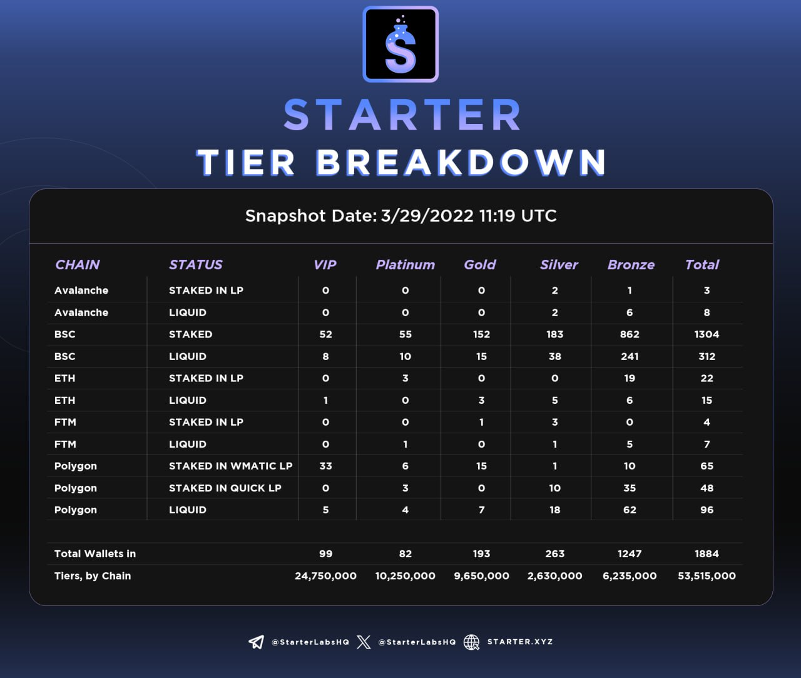

# 🌧️ Stake Drop

### How Does The Stake Drop Work? 

All prior holders of START will be airdropped locked (aka "Stake Dropped") BUIDL tokens, allowing them to participate in the new IDO economy as we resume operations. The duration of the lock will be based on the tier that each wallet falls in.&#x20;


* **Gold, Silver,** and **Bronze** tiers will be locked for a randomized duration between 3 to 6 months. Locked tokens will earn [Staking Rewards](staking-rewards.md) like regular staking.
* **Platinum** and **VIP** tiers will be locked for a randomized duration between 9 to 12 months and will also earn [Staking Rewards](staking-rewards.md).


The number of START tokens distributed across chains, both staked for IDO participation and liquid in wallets are shown below.

<figure><figcaption></figcaption></figure>

### Tiers by Chain  

The amount of BUIDL stake dropped will match the amounts required for the new tier structure. A look into the tiers by chain can be seen in the table below along with the total BUIDL that will be distributed.

<figure><figcaption></figcaption></figure>
