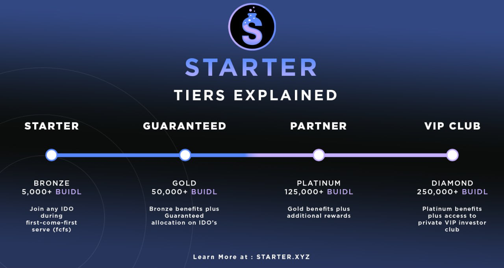
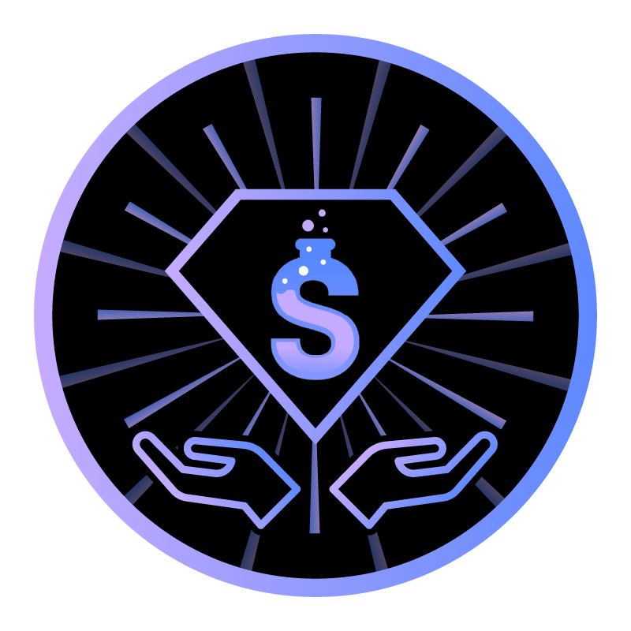

# ✨ Tiers & Staking


**Skip the Line:** Tiers are a great way to guarantee your place in the front of the line. Larger stakes are a strong indicator that you're actively supporting projects on our platform.


<figure><figcaption></figcaption></figure>

BUIDL token holders can stake their tokens on Starter to gain access to the platform and obtain benefits according to the tier. Staking higher amounts of BUIDL gives holders increased access and even greater benefits.

### Access and Reward Tiers

**IDO Participation:** Staking at least 5000 BUIDL tokens on the platform qualifies holders for **Starter Tier** status and allows them to participate in all approved presales on Starter. &#x20;

**Voting Power**: Staking at least 5000 BUIDL tokens allows holders to vote on which projects are approved for a presale on Starter.

**GA:** Staking 50000 or more BUIDL tokens qualifies holders for **Gold Tier** status, which gives those community members a **Guaranteed Allocation** for every presale created using a Guaranteed Allocation model.\
\
**Revenue Sharing**: Staking at least 125,000 BUIDL tokens allows holders to earn rewards in the form of token fee revenue share on Starter. Ten percent (10%) of tokens earned on Starter platform fees will be redistributed to this tier.

**VIP Club**: Staking at least 250,000 BUIDL tokens for at least 21+ consecutive days give holders membership to our exclusive VIP Club. Benefits includes preferred access to private allocations, special airdrops of IDO tokens, access to our private group, and influence in the platform's future development. Holders must not have sold any BUIDL in the past 21 days to maintain membership.\
\
**Super VIP**: This tier is reserved for stakers who would like to share in 25% of platform revenue and have a voice in the future direction of the platform. You must lock and maintain a stake of at least 5,000,000 BUIDL tokens for 365+ days to be eligible for this benefit.


Unstaking BUIDL will incur burn fees according to the schedule [in Staking Rewards](staking-rewards.md).



Burn fees start from either your first staked time or your last IDO participation time, whichever is greater.  Additional staking does not reset your staked counter, but unstaking does.  Claiming rewards has no effect on your staking.


## GA Head Start and Diamond Hands

Stakers who hold at least a Guaranteed Allocation Tier will have a Head Start before anyone else can join a pool. This Head Start is usually defined in minutes, such as 15, 30, or 60 minutes, is configurable per project and is determined by the pool creator.

### Diamond Hands Staker

The date and time of your first stake deposit is tracked to determine how long you have been staking. This is used to determine whether or not you are a Diamond Hands Staker. Diamond Hands Stakers are next in line after Guaranteed Allocation Tiers have ended their Head Start period.&#x20;


**You must be staking for at least 7 days in order to be considered a Diamond Hands Staker.** Unstaking at any time resets your Diamond Hands Staker status and you will have to start again with a new deposit.

Diamond Hands Stakers are the only ones who can participate in IDOs **for up to 5 minutes after the Guaranteed Allocation Tier Head Start period ends.** Once Diamond Hand Stakers have completed their allocation time, the pool is opened to all participants on a first-come-first-serve basis.


<figure><figcaption>
Diamond Hands Staker
</figcaption></figure>
