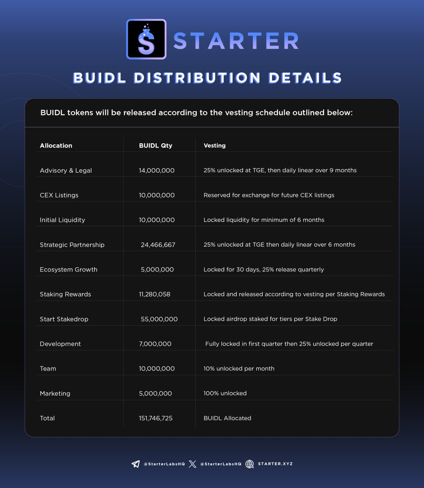

# 💹 Tokenomics

<figure><figcaption>
BUIDL 404 Token Logo
</figcaption></figure>

### BUIDL 404 Token 

**Ticker:**  BUIDL

**Chain:** Base (ERC20)

**Contract Address:**&#x20;

[https://basescan.org/token/0x40Be61a8C047e84Aa974eac296eaaBF09945D3b2](https://basescan.org/token/0x40Be61a8C047e84Aa974eac296eaaBF09945D3b2)

**Max Supply:** 215,000,000 (_fully distributed with vesting; no minting_)

#### Deflationary Mechanism 

* BUIDL will be burned when unstaked, according to the schedule outlined in [Staking Rewards](staking-rewards.md).
* The aforementioned burn settings can be adjusted based on community voting.

### BUIDL Token Utility 

BUIDL token holders can stake their tokens on Starter to gain access to the platform and earn rewards. Staking higher amounts of BUIDL gives holders increased access and even greater rewards.

Detailed information about the utility of BUIDL can be found in [Tiers and Staking](tiers-and-staking.md).

### BUIDL Token Initial Distribution 

To prove the concept and pave the way for future Starter IDOs, the BUIDL token will be distributed to supporters through a token sale on the Starter platform itself. This is to demonstrate the power of Starter as a fully functional, performant launchpad to our first believers.

#### BUIDL Presale Pool Details 

<figure><figcaption></figcaption></figure>

#### BUIDL Distribution Details 

<figure><figcaption></figcaption></figure>

