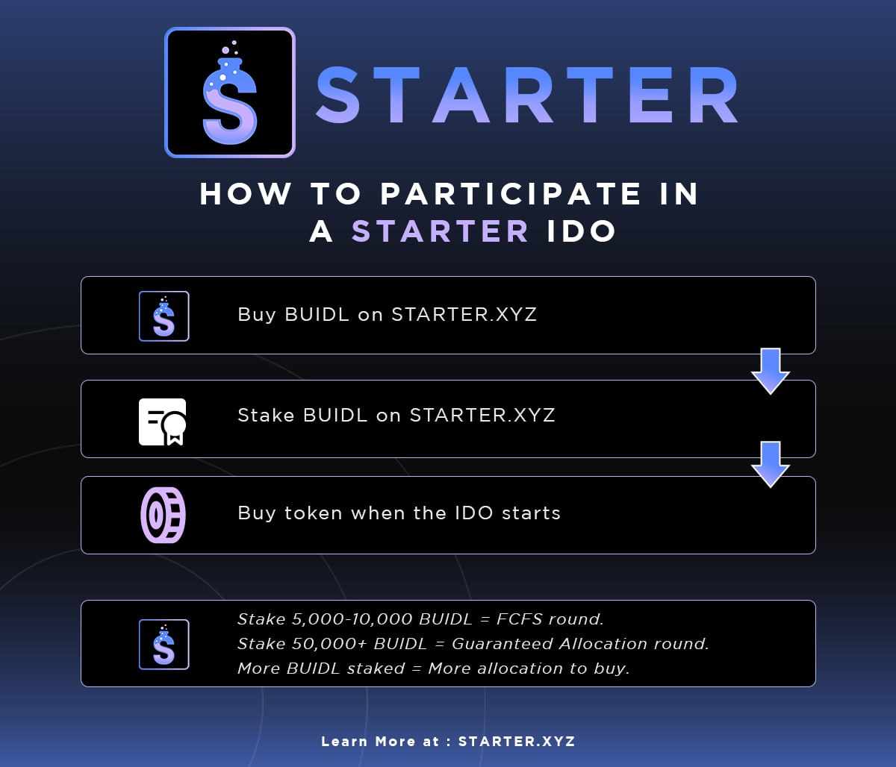
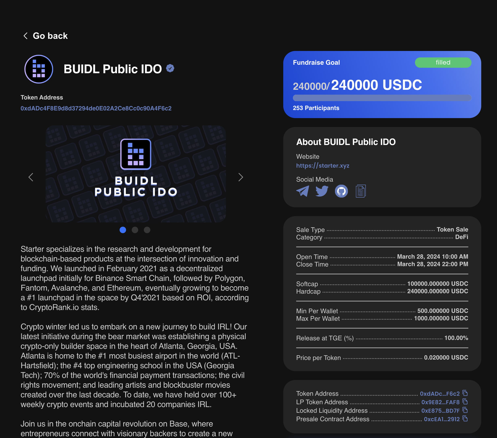
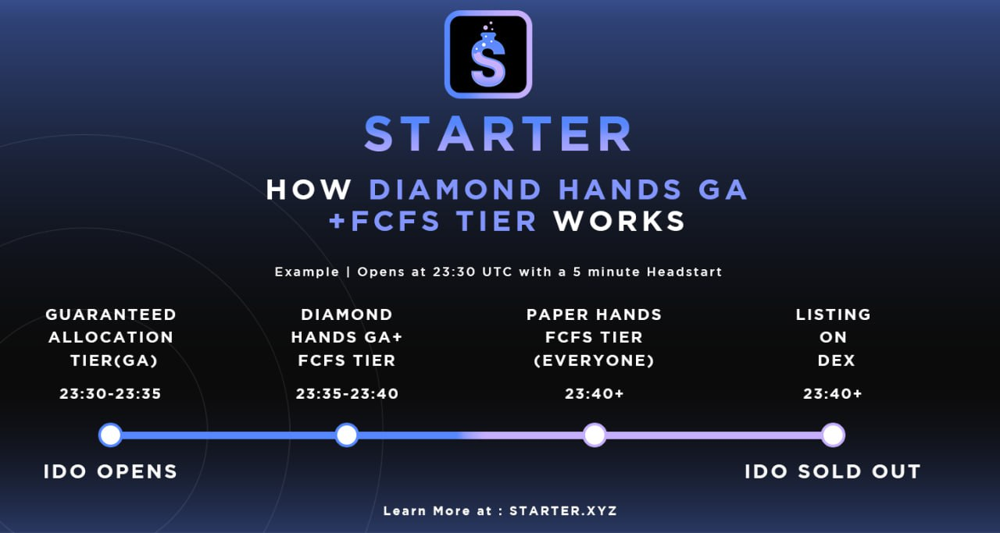

# 💸 How to Participate in a Project's Fundraising

Taking part in an IDO or token sale is simple:

<figure><figcaption></figcaption></figure>

Buy $BUIDL directly on the [Starter](https://starter.xyz) website, Uniswap V2, or any supported DEX.

Once you have $BUIDL, you can stake them on the [Starter](https://starter.xyz) website and will be assigned to a tier based on the amount staked.

After staking, you are now eligible to participate in an IDO when it opens for fundraising. Buy the IDO tokens with the currency requested by the IDO (such as ETH, USDC, etc). Check on the project's listing page for full details.

**Useful Links:**

**Buy $BUIDL on Uniswap or another DEX listing $BUILD:**

https://app.uniswap.org/#/swap?chain=base[^1]

**Stake your BUIDL tokens on** [**starter.xyz**](https://starter.xyz) **to be eligible for the IDO:**&#x20;

[https://starter.xyz](https://starter.xyz)

#### The Tiers & Allocation

<figure><figcaption></figcaption></figure>

The amount of BUIDL you have staked will decide which tier you fall into, the benefits you gain, and the amount of IDO token you are allocated to buy.

**5000 BUIDL** will land you in the first come first served tier (FCFS). This means when FCFS opens you will be able to buy so long as there is enough of the IDO token remaining for sale.

_**You can also vote for any decentralized IDO. The more BUIDL you stake, the more votes you will have to use!**_

**50000 BUIDL** sits you comfortably in the Guaranteed Allocation tier. Everyone with 50000 BUIDL will have a small Guaranteed Allocation reserved for them at the start of every IDO with a head start. The amount of your Guaranteed Allocation will depend on how much BUIDL you have staked. The more you have staked, the higher your Guaranteed Allocation will be.

Before an IDO begins the Guaranteed Allocation tier will be visible in the **Maximum Investment** section (see project listing for details). This number will show only what your Guaranteed Allocation is during the _Head Start_ period. After the Guaranteed Allocation Head Start round is over and FCFS opens, this ‘Maximum Investment’ will increase by a large multiple.&#x20;

The FCFS tier will see nothing here until the FCFS round opens.

<figure><figcaption></figcaption></figure>

**125,000 BUIDL** staked will get you a larger guaranteed allocation and access to the Platinum members club.

The Platinum members club forms part of the Starter network and has access to unique benefits, including exclusive private sales. Random checks are carried out to ensure the required amount of $BUIDL is staked to allow continued membership.

**250,000 BUIDL** staked for at least 21+ days consistently grants you access to an even more exclusive club, the VIP members club.

This tier is made up of high-ranking holders and some of our most valued investors in our network. Expect exclusive news and ‘alpha’, as well as the majority of Private Sale or VIP Sale opportunities. Access is based on more than just staking the correct amount of $BUIDL. Random checks are carried out to ensure the required amount of $BUIDL is staked.

#### The Participation Rounds during an IDO

<figure><figcaption></figcaption></figure>

\*Currently staking anywhere outside of **starter.xyz** will not qualify for Diamond Hands\*

There are 3 rounds during an IDO.

**Head Start:** The first is the Head Start round. This is only for people in Gold Tiers and above. In this round, they will be able to buy only their Guaranteed Allocation amount, not the maximum allowed for their wallet.

**Diamond Hands FCFS:** The second round is the Diamond Hands FCFS round. This is for all tiers who have been staked for more than a certain period (currently 2+ days), so it pays to get staked early. You can have 5000 BUIDL and not be able to buy in this round if you staked it less than 2 days before the IDO opens.

**Paper Hands FCFS:** The third round is the Paper Hands FCFS round. This round is for everyone with 5000 BUIDL staked. In this round the maximum investment amount per wallet is available.

[^1]: 
