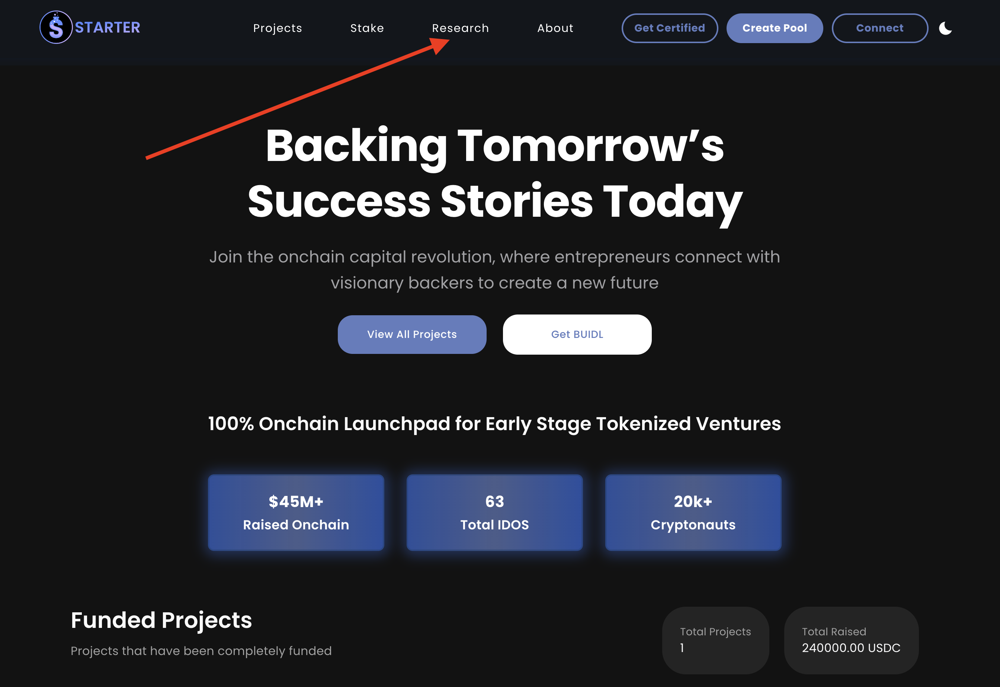
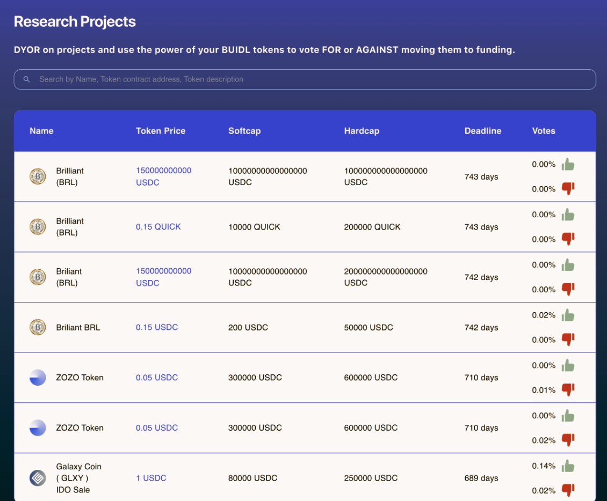
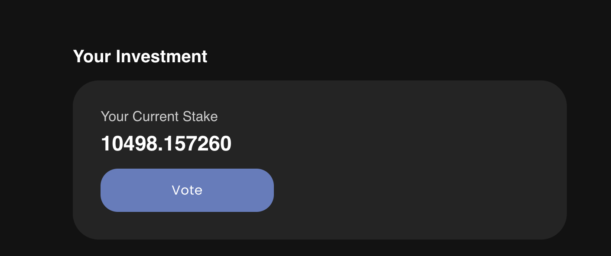

# 🔍 How to Research and Vote on Upcoming Projects


This guide assumes you have already purchased and Staked BUIDL on Starter.  Please read the "[**Tiers & Staking**](../overview/tiers-and-staking.md)["](../overview/tiers-and-staking.md) guide for more details.


Staking at least 5000 BUIDL tokens on Starter gives you the right to Vote on which projects are approved for a presale.  The voting process is quick and simple, but the due diligence you perform prior to voting should be thorough!

* Go to the Starter website (https://starter.xyz[^1])
* Connect your Web3 wallet (we will be using MetaMask in this guide but Coinbase Wallet can also be used) and make sure your network is set to Base mainnet. A guide for setting this up is located on the sidebar.
* Next, Click on the "**Research**" tab to pull up a list of all the pending presales that are eligible for voting and needs to be researched.

<figure><figcaption></figcaption></figure>

&#x20;                                                                                      :arrow\_down:

<figure><figcaption></figcaption></figure>

* Select the project you wish to vote for and thoroughly review the terms and relevant links.
* In the "**Your Investment**" section, you can see how many BUIDL you have staked on the platform.  This is your voting weight.
  * _e.g. 1000 BUIDL = 1000 Votes_
* Click on the "**VOTE**" button to pull up the Confirmation box that reminds you of the due diligence every investor should perform prior to voting.​
* Once you have made your decision, make your voice heard by clicking "**Yes**" or "**No**" and confirm the transaction in your wallet.

<figure><figcaption>
Vote on projects using your staked BUIDL
</figcaption></figure>

&#x20;                                                                                      :arrow\_down:

<figure><figcaption></figcaption></figure>

* Once the transaction is confirmed, your votes will be added to the totals in the project.
* Congratulations! Your part of the voting process is complete.  Now just wait for the project voting timer to end to see the result!


Only presales that receive at least 21,500,000 more "Yes" votes than "No" votes will proceed with a presale. _**1 BUIDL = 1 Vote**_


[^1]: 
