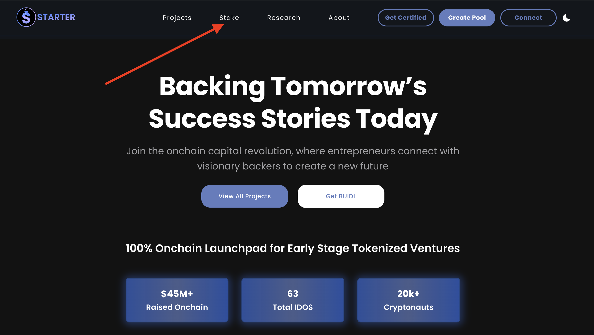
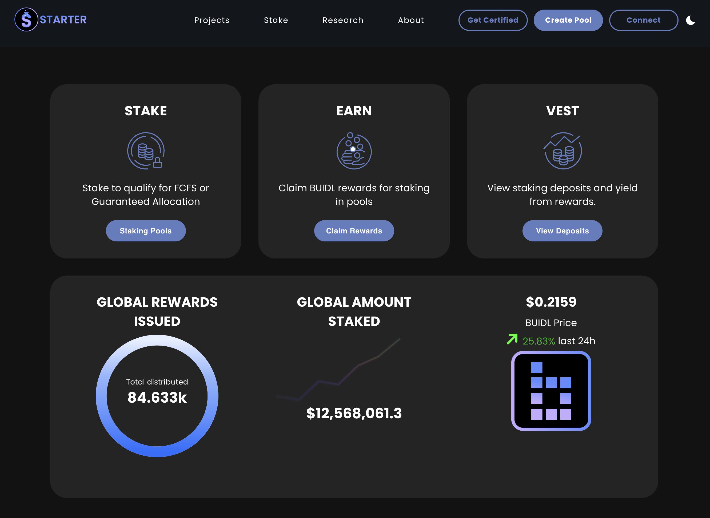
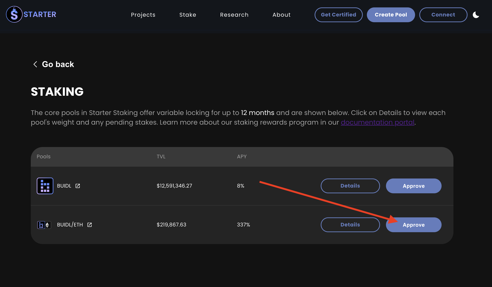
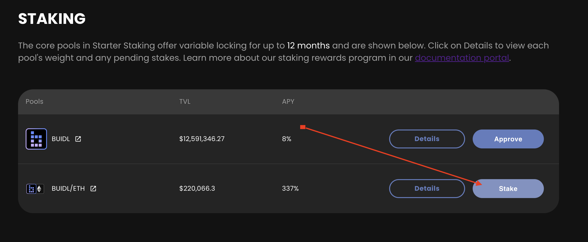
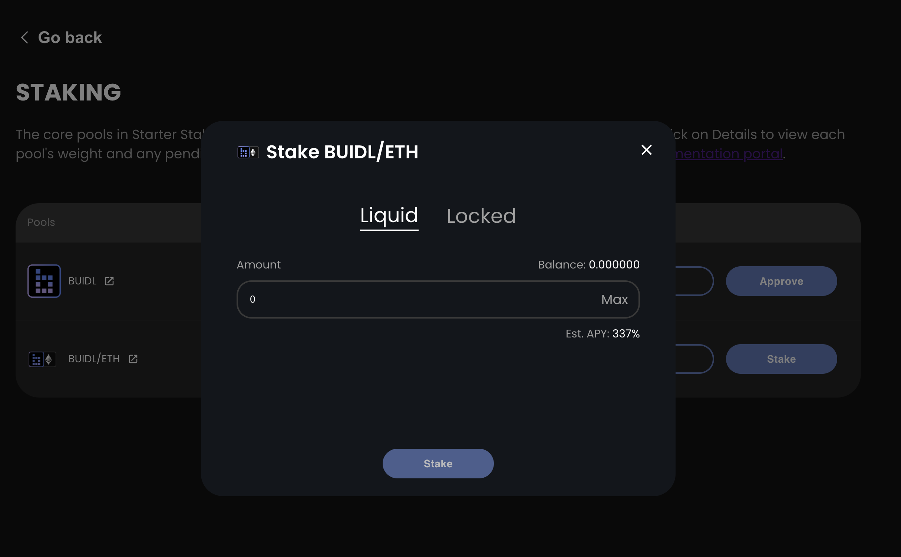
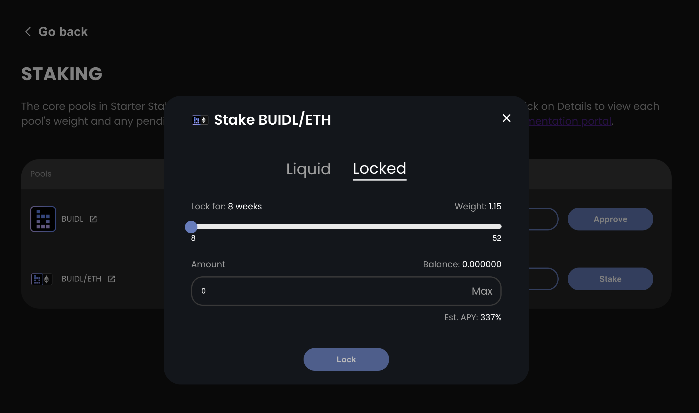
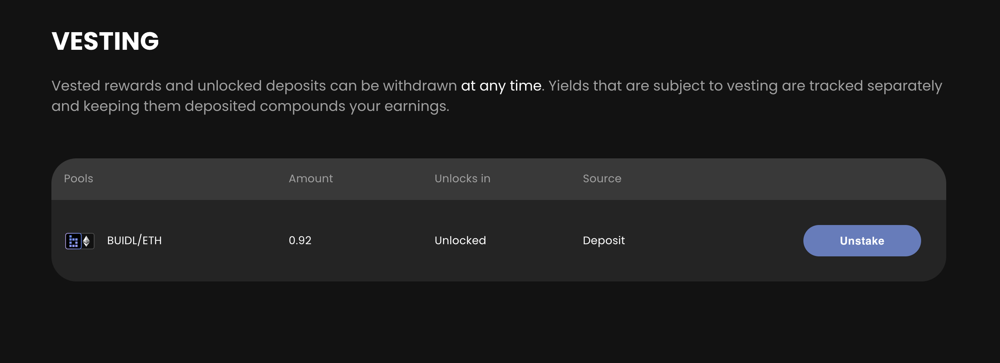

# 🔐 How to Stake Tokens and Secure Your Tier

Staking on Starter is a simple process requiring only a few clicks to join the community and start getting access to early stage projects on Base!

* Go to the Starter website ([https://starter.xyz](https://starter.xyz))
* If aren't already a BUIDL token holder, the "**Buy BUIDL**" link will take you to a DEX where you can purchase some with any other tokens you own.
* Connect your Web3 wallet (we will be using MetaMask in this guide but CoinBase Wallet is also supported) and make sure your network is set to Base mainnet.  A guide for setting this up is located on the sidebar.
* Follow the prompts displayed below to complete the connection.
* Next, Click on the "**Stake**" link to pull up staking pools, staked balances and vesting rewards.

<figure><figcaption></figcaption></figure>

&#x20;                                                                              :arrow\_down:

**STAKE** shows you the pools currently available for staking, allowing you to qualify for first-come-first-serve or guaranteed allocation for IDOs on Starter. **EARN** allows you to claim BUIDL rewards from staking. **VEST** allows you to view staking deposits and pending yield from rewards.

* Click Staking Pools to open the BUIDL and BUIDL/ETH staking pools
* Confirm the transactions in your Web3 wallet.  Do not adjust the default Gas Price & Limit.

<figure><figcaption>
Staking Dashboard
</figcaption></figure>

:arrow\_down:

* Once Staking Pools appear, click Approve on the pool you would like to stake into. Currently, only the BUIDL single-sided staking (SSS) pool allows you to stake and earn a tier. You can earn additional BUIDL tokens by staking in either the BUIDL/ETH LP or BUIDL SSS pool.

<figure><figcaption>
Click Approve to Begin Staking
</figcaption></figure>

* Once the Approve button succeeds, it will change into a Stake button. Click Stake to open the Staking dialog.

<figure><figcaption>
Click Stake to Open the Staking Popup
</figcaption></figure>

* Liquid staking deposits can be withdrawn at any time.&#x20;
* Input the amount of BUIDL you wish to stake and click the Stake button to proceed.

<figure><figcaption>
Liquid Staking
</figcaption></figure>

* Selecting Locked allows you to lock your staking deposit for a minumum of 8 weeks up to 52 weeks (1 year). The longer you stake, the higher your BUIDL staking rewards will be.
* BUIDL staking rewards are vested automatically. Locking your stake for the maximum of 52 weeks allows you to claim staking rewards within 45 days. Locking your stake for the minimum of 8 weeks allows you to claim staking rewards in a year.

<figure><figcaption>
Locked Staking
</figcaption></figure>

&#x20;                                                                                 :arrow\_down:

* Unstaking your previously staked deposits is very simple. Simply click on the Vesting tab to bring up the list of deposits.&#x20;

<figure><figcaption>
Unstaking is very simple
</figcaption></figure>

* You may unstake your BUIDL tokens from the platform by clicking the "**Unstake** button. BUIDL/ETH deposits are NOT subject to any burning fees while BUIDL single-sided staking deposits are subject to an unstake burn schedule.


BUIDL tokens staked on Starter are currently subject to an [**unstaking burn schedule**](../overview/staking-rewards.md) to prevent abuse of the platform.  Additional staking or unstaking resets the locking period.  Claiming rewards has no effect on the locking period.

